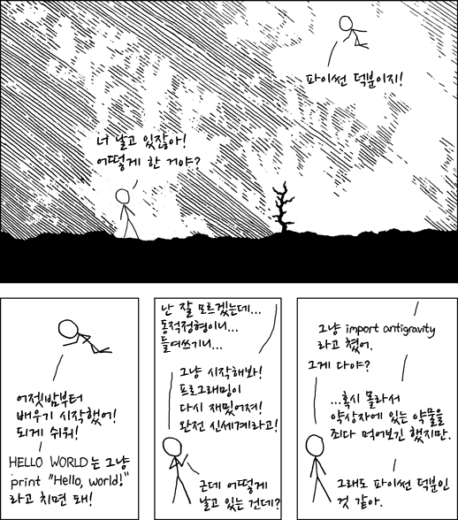

# Python Camp 2019 with MMMIL
---

안녕하세요.  
MMMIL(Multi-Modality Medical Imaging Lab)에서 겨울방학 기간에 **인공지능을 위한 프로그래밍 스터디** 를 함께 할 학우 여러분들을 찾습니다.

#### "Life is too short, You need Python."

## 1. 주제
   - Python & 유용한 Python 패키지
   - 프로그래밍을 위한 필수 도구
   - 실력 향상 프로젝트

## 2. 일정 : 2019년 1~2월
   - 이론 및 실습
     - 1월 7일 ~ 1월 25일 (3주) 
     - 주3회 (월, 수, 금)
     - 10\~16시 (12\~13시 점심시간 제외 5시간)
       
   - 프로젝트 : 이론 스터디 이후 남은 방학기간에 진행

4차 산업혁명의 흐름 속에서 전성기를 맞이한 인공지능(Deep Learning) 기술은 거의 모든 분야에서 응용되고 있습니다. 저희 의용생체공학 분야도 예외는 아닙니다. X-ray 영상으로부터 뼈의 나이를 분석하는 기술을 개발한 [**VUNO**](https://www.vuno.co/)와, chest radiography로부터 의사의 판독을 보조하여 폐 결절(폐암)을 검출하는 기술을 개발한 [**Lunit**](https://lunit.io/), 저희 가천대 길병원에서 한국 최초로 도입한 [**IBM Watson**](https://www.ibm.com/watson/) 등이 의료 인공지능의 대표적인 사례입니다.  

전문 개발자가 아니더라도 자신의 아이디어를 구현하기 위해 한두 가지 언어의 프로그래밍(코딩) 실력을 갖추려하는 사람들도 늘어나고 있습니다. 애플의 창업자 스티브 잡스는  `"코딩은 생각하는 방법을 가르쳐줍니다"` 라고 말했으며, 마이크로소프트의 창업자 빌 게이츠 역시 `"사고력과 문제해결 능력을 향상시킨다"` 라며 [**코딩의 중요성**](https://blog.naver.com/moeblog/221259634838)을 강조했습니다.  

의료영상과 인공지능을 연구하고 있는 저희 MMMIL은 학우 여러분의 잠재된 프로그래밍 능력을 깨우기 위한 겨울방학 스터디를 진행하고자 합니다. 의용생체공학과 학우 여러분의 **'나만의 무기'**, 프로그래밍은 어떠신가요?